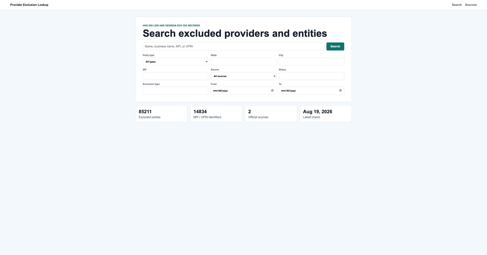

# Provider Exclusion Database

This project builds a PostgreSQL database for healthcare provider exclusion records from two official sources:

- HHS OIG LEIE exclusion list
- Georgia DCH OIG exclusion list

The goal is to clean raw exclusion files, organize the data into relational tables, and make provider exclusion records easier to search and maintain.

## Project Structure

```text
data/raw/                     Raw source files
data/cleaned/                 Cleaned CSV files generated by scripts/clean.py
database/                     PostgreSQL schema and database setup files
docs/                         Database diagram files and project notes
scripts/                      ETL scripts for cleaning and loading source files
web/                          Django Provider Exclusion Lookup website
requirements.txt              Python dependencies
```

## Data Sources

The raw files are stored in `data/raw/`:

```text
07-2026 Updated LEIE Database.csv
Copy of Department of Community Health Office Of Inspector General List of Excluded Individuals and Entities as of August 7 2026- georgia.xlsx
```

The cleaned output files are generated in `data/cleaned/`:

```text
data_source.csv
import_log.csv
excluded_party.csv
identifier.csv
exclusion_record.csv
```

## Database Design

The database uses five main tables:

```text
data_source       Source file information
import_log        Import record for each source file
excluded_party    Excluded individual or entity
identifier        NPI or UPIN values connected to a party
exclusion_record  Exclusion details such as date, type, waiver, and status
```

Table relationships are shown in:

```text
docs/dbdiagram_provider_exclusion.dbml
docs/dbdiagram.pdf
```

## Django Lookup Website

The Django website provides a search interface for looking up excluded providers and entities.

Users can search by name, business name, NPI, or UPIN. Optional filters include party type, state, city, ZIP code, data source, status, exclusion type, and exclusion date range.

After submitting a search, the results page shows matching excluded individuals or entities with summary information such as name, provider category, location, identifier, exclusion status, exclusion date, exclusion type, and source. Each result can be clicked to open a detail page with the full party information, identifiers, and complete exclusion record history.

Example search interface:



## Workflow

1. Create the PostgreSQL tables:

```bash
psql -d exclusion_db -f database/schema.sql
```

Or run `database/schema.sql` in pgAdmin Query Tool.

2. Install Python dependencies:

```bash
python3 -m pip install -r requirements.txt
```

3. Clean the raw source files:

```bash
python3 scripts/clean.py
```

This appends new cleaned rows to `data/cleaned/`. If the same source file was already cleaned, it is skipped to avoid duplicates.

4. Load cleaned data into PostgreSQL:

```bash
python3 scripts/load_database.py
```

This inserts new rows into the database. Existing primary keys are skipped with `ON CONFLICT DO NOTHING`.

5. Run the Django lookup website:

```bash
cd web
python3 manage.py runserver
```

The website connects to the existing PostgreSQL tables. You can override the database connection with environment variables:

```text
DB_NAME
DB_USER
DB_PASSWORD
DB_HOST
DB_PORT
```

## Notes

- LEIE `EXCLDATE` is mapped to `exclusion_date`.
- Georgia `SANCDATE` is mapped to `exclusion_date`.
- LEIE `NPI = 0000000000` is treated as missing and is not inserted into `identifier`.
- Empty source values are loaded into PostgreSQL as `NULL`.
- The project is designed for monthly updates by appending new cleaned data instead of overwriting old data.
